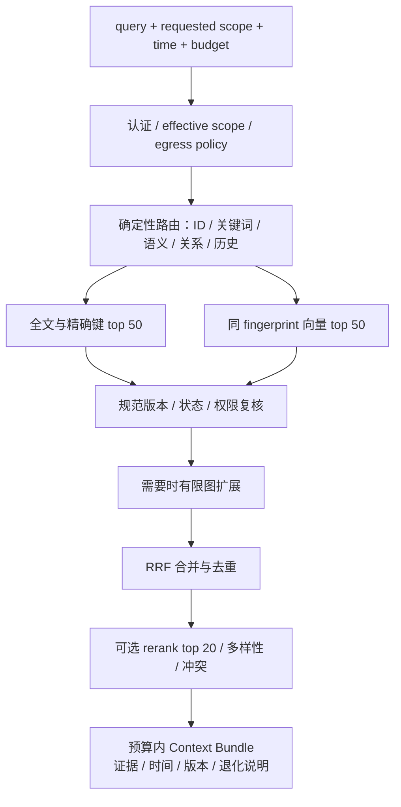

# 记忆记录、向量与知识图谱检索方案

日期：2026-09-26。状态：设计草案，尚未实现。服从 [总体架构](memory-service-architecture.md) 的范围、版本与主库约束；阶段验收见 [路线图](memory-roadmap.md)。外部机制来源见 [调研报告](../reports/2026-09-26-memory-landscape.md)。

## 1. 四类数据，分别处理

| 层 | 内容 | 更新方式 | 查询用途 |
| --- | --- | --- | --- |
| 来源证据 | 消息、工具结果、文件 revision、网页版本、人工输入 | 幂等追加或显式撤回 | 证明是谁在何时说了什么 |
| 规范记忆 | 原子事实、决策、偏好、程序性经验 | 修订、冲突审查、有效期 | 返回当前或指定历史事实 |
| 检索投影 | FTS、向量、实体/关系、词典 | 由规范 revision 重建 | 召回和排序，不能独立宣布事实 |
| 工作上下文 | 当前任务、相关事实、待验证事项、handoff | 从获准来源按预算生成，可过期 | 给当前模型短小上下文 |

向量不能判断事实是否已经过期；图中的边也不是凭空成立的证据。所有最终结果必须回到规范记录或明确引用原始来源。

## 2. 采集与记录处理

处理链：接收与验证 → 去秘密/规范化 → 事件持久化 → 安静窗口合并 → 结构抽取 → 去重/冲突 → 规范修订 → 全文/向量/图投影 → 上下文失效。

### 2.1 最少而充分的采集

- 用户明确“记录”“决定”“修正”的输入进入显式提案链；不是让模型无条件自行解释为正式批准。
- 自动会话捕获按 source_app、项目、敏感级别允许；同一轮多次 Stop/Interrupt 使用稳定消息 ID 去重。只捕获已允许来源，不全盘扫描所有会话目录。
- 无证据的 assistant 总结、失败重试日志、临时 token/端口不自动晋升为长期事实；必要时作为有限保留期的 source 或 task_checkpoint。
- 原始会话与提取后的 memory 分别计数。一次事件可生成零条或多条提案，不能以“消息导入成功”冒充“记忆已保存”。
- 代码/文件变更优先保存 repo_id、commit/worktree revision、路径与 span；文件内容是否复制由保留策略决定。跨机器路径只是定位提示，不是唯一身份。

后台抽取初始采用会话安静 60–120 秒合并、单任务有 token/时间预算，明确的记忆写入无需等整轮会话收尾。后台任务失败分类、指数退避、最大重试与隔离队列；重试不阻塞其他项目。

### 2.2 抽取内容与状态

候选至少包含主体、谓词/事实正文、对象、project、environment、valid time、claim_status、来源 span。提取器找不到支持片段时标记 unverified，不伪造引用。LLM confidence 只作为待审线索，不能替代事实证明。

同一事实多来源保留多条 evidence_links；同一消息被另一模型总结属于同一来源家族，不能累加成更高可信度。用户纠错优先触发旧版本失效与新提案，普通“更近的说法”不自动推翻明确批准的决策。

去重分三级：事件 ID 重放去重；同 owner/space/project/kind/事实目标的规范内容 hash 精确去重；语义相似只产生候选合并提案。跨项目相似文本不合并。设备 A 的配置和设备 B 的配置可以文本相似但属于不同事实。

## 3. 中文、代码与全文索引

先把 title/body/source_ref/实体名/项目列投影为结构字段，避免每次扫描并解析全库 JSON。规范 revision 与 FTS 更新可在同一 SQLite 事务完成；外置索引使用任务与 watermark。

采用三条互补路径，全部先约束可访问范围：

1. **精确键路径**：memory ID、项目 ID、主机别名、commit、路径、错误码，用普通索引和别名映射。精确匹配保留大小写原值，规范化副本只用于搜索。
2. **词项路径**：英文/代码 token 与版本化中文分词词典，FTS5 BM25；title/项目别名/实体名可在开发集调权。分词器与词典变化产生新 generation。
3. **子串路径**：trigram 对三个及以上字符候选，中文双字/单字依赖分词/双字辅助索引或显式范围内 LIKE。短词扫描设置行数/时间预算；超预算返回 truncated/degraded 与缩小范围建议，不能假报“没有记忆”。

对标“记忆”“M3”“nmem”“0.10.86”“content.db”“can-key”等真实查询，不能只测英文整词。索引中的原文片段可能过期，最终呈现仍按规范 revision 回读。

## 4. 向量索引

### 4.1 嵌入粒度

原子 memory：标题 + 主体/事实 + 必要限定条件；消息历史：按会话转折和任务边界分块，不为每条工具噪声生成向量。初始 chunk 目标 300–600 tokens、最大重叠 60 tokens，跨 chunk 保留源 span；数值属于实验起点，按真实数据调优。

chunk ID 由 source revision、chunker version 与稳定 span 组成。重复导入不重复付费；缓存键包含文本 hash、embedding fingerprint、owner/egress domain，不能跨隐私域共享内容可识别缓存。

`embedding_fingerprint = provider + resolved_model_revision + dimension + normalization + input_template + quantization + schema_version`。服务商不能提供稳定 revision 时，固定本地配置版本并做 canary 向量兼容检查；发现漂移阻止与旧向量混用。

### 4.2 提供商与后端

首期选一套支持中文/英文/技术文本的 embedding，经同一开发集比较远程与 M3 本地候选；不在设计文档指定未经本机验证的“最佳模型”。查询与入库使用同一 fingerprint。生成模型可以任意切换，不影响向量空间。

首选 sqlite-vec 做隔离实验，索引模型版本分表/命名空间，owner/space 为安全分区，project/状态为可验证过滤条件；agent/model/device 不全部物理分片。只有在合法范围内比较候选，不能全库 top-K 后裁剪导致跨项目遗漏或信息侧漏。

例如 100,000 个 768 维 float32 向量原始约 293 MiB；1,000,000 个约 2.86 GiB。这里没有包含索引、payload、缓存、allocator 或模型权重；100,000 向量并不等于 100,000 消息。必须先统计实际 chunk 数与复制比例。

达到阶段延迟或内存预算后，再测 Qdrant ANN、磁盘存储与量化；用精确检索作为召回 oracle。量化不能只报告 RAM 降幅，也要报告中文/短事实/数字否定题召回下降。若将来采用 pgvector，特别验证选择性过滤后的候选不足问题。

### 4.3 换模型与重建

创建 B generation → 后台分批嵌入 → 新写入同时投影 A/B → 捕捉规范变更游标 → 校验范围/删除/覆盖率 → 固定测试集比较 → 原子切换 active manifest。读请求只使用一个 fingerprint；重建期间优先旧索引或 FTS，不混合两个向量空间距离。

若实验比较多个向量模型，各自形成完整排名，再用评测定义的融合策略；不能直接平均跨模型 cosine。切换保留上一代短期回退，回退仍必须应用最新撤回与权限规则，不能复活旧事实。

## 5. 知识图谱

### 5.1 首期领域本体

| 节点 | 例子 | 身份规则 |
| --- | --- | --- |
| Project | los-memory、CanKey | 项目注册表，不按自然语言名称猜合并 |
| Device / Service | M3、NAS34、Nowledge、los-memory | 稳定资源 ID，区分宿主/VM/服务 |
| Decision / Procedure | 双轨决定、部署流程 | 指向规范 memory revision |
| Incident / Evidence | 索引漂移、一次测量、commit、线程片段 | 带来源和时间，原始内容受权限保护 |
| Concept | 幂等、有效期、向量模型 | 可做语义连接，不代表发生了事实 |

关系优先限定为 runs_on、belongs_to、depends_on、supersedes、contradicts、supported_by、derived_from、applies_to。共现单独用 mentions/co_occurs，不冒充 depends_on 或因果关系。代码调用依赖交给代码图工具，在 memory 中保留项目/revision/symbol 引用。

边记录 source/target ID、predicate、scope、claim_status、valid_from/to、recorded_at、证据 revision、抽取器版本；失效边保留历史。旧观点与新决策用 supersedes，冲突未解决时双边保留并提示，而不是删除较旧文本。

实体合并：同范围规范 ID 精确匹配 → 人工注册别名 → 向量/文本候选 → 冲突检查。不同项目同名实体不自动合并；“M1”和“M3”不能因语义相近合并。别名绑定可撤回，合并记录可拆分恢复。

### 5.2 检索时的有限图扩展

图不是每次查询必经步骤。检测明确实体、历史演变、依赖/原因/跨项目已授权问题时启用。从召回种子或规范实体启动，初始最多两跳、200 条边、50 个候选记忆，按 scope、valid time、edge type 过滤；每一步都检查权限，不允许先跨私有节点再隐藏它。

边权不能以热度压过证据质量；图扩展返回“路径 + 每条边来源”，不是模型补全的虚构连接。撤回某个来源后，失去唯一支持的边立即隐藏，相关 summary 失效。

第一版使用 SQLite 关系表 + 复合索引 + 有界 BFS/递归查询。只有真实关系题的提升通过门槛且路径查询成为瓶颈，才在 M3 沙盒评估 Graphiti 或图数据库；通过后再讨论常驻部署。需要全项目历史综述时异步构建 community summary，不能每次 prompt 全图 map-reduce。

## 6. 查询执行计划

默认不调用 LLM 改写 query；精确 ID/路径走直达，概念改写才启用向量。复杂时间意图可用受限 parser，解析失败保留原查询并显式提示，不能伪造时间约束。敏感查询必须在 embedding 之前完成出站许可检查。

基础融合采用 RRF：`score(d) = Σ weight_i / (60 + rank_i(d))`。60 和 top-K 是初始实验常量，须在开发集选定并冻结；不用不可比的 BM25、cosine、图路径分数直接加权求和。将过期、撤回、越权、错误 revision 排除是硬规则，不是排序扣分。

对不同来源 chunk 按 memory/source family 去重；新鲜度只在要求当前事实且来源同等级时作为偏好，不能让最近的未验证猜测覆盖已批准事实。可选 rerank 仅看范围内 top 20，并遵守 egress；超时或模型不可用返回原融合结果，附 rerank_skipped。

每个候选携带 index_generation 与 canonical_revision。回读发现版本落后就丢弃或重新召回，并发撤回在响应构造前再次检查；缓存键含权限 epoch 和 revision。用户缺少历史权限时，不通过候选分数、计数或边信息泄露隐藏内容。

默认 top 5–10 条、2,000 tokens 上下文预算，可按客户端请求到硬上限 6,000；保留最少的相关证据片段与可继续读取 ID，不把全部 thread 放进 prompt。使用目标模型 tokenizer；无法确定时采用保守字节上限并报告估计方式，不能把字符数等同 token 数。

无足够证据时输出 missing_evidence；分开“没有相关记忆”“投影未就绪”“权限不允许”“数据源离线”，但拒绝信息不透露其他空间是否存在。

## 7. Working Memory 与跨 agent 续接

Bundle 内容分为当前项目/任务、已批准决定、相关偏好、未解决冲突、待验证状态和来源入口。agent-private 草稿不会进入另一个 agent 的共享 bundle。项目规则只保存权威文档入口，不从会话总结生成新的全局规则。

生成键包含 owner/space/projects/principal、task、permission epoch、规范变更游标、bundle recipe version。修订、撤回、项目映射或权限变化会失效；TTL 只是辅助，不能代替变更失效。不能缓存一个用户级大摘要交给所有 agent。

handoff 保存目标、已完成证据、未完成步骤、当前代码 revision、失败与约束、来源 thread IDs；接收者先复核运行事实。不同模型 token 预算改变仅影响组装，不改变规范记忆。摘要结论若缺少可回读证据，不进入高可信区。

## 8. 退化、删除和可观测性

| 故障 | 可用行为 | 必须暴露的状态 |
| --- | --- | --- |
| embedding 服务不可达 | 精确键 + FTS，后台重试 | semantic_unavailable，不伪装语义检索完成 |
| 图索引落后 | 向量/FTS 与规范来源 | graph_watermark，禁止引用已撤回边 |
| 全文索引失败 | 按 ID 正文读取；小范围受限扫描 | lexical_degraded 与范围覆盖 |
| 规范库不可用 | 仅有限、带日期缓存 | offline/stale；写入 queued，不能返回 accepted |
| 处理预算耗尽 | 已接收事件保留，后台暂停昂贵阶段 | queue_lag、budget_exhausted |
| 删除任务未完成 | 规范 tombstone 先阻断结果 | erasure_pending 和剩余投影/设备类别 |

指标按 host、source_app、project scope 的非敏感 ID、模型任务类型分开：采集接收/失败/重复、规范 revision、待审数、提取错误、每阶段队列年龄、索引覆盖/游标、FTS/向量/图贡献、用户选中来源、按 ID 版本不一致、p50/p95、CPU/RSS、IO、请求字节与模型 token/cost。检索相关但未被使用不等于“错误”；点击也不是事实正确性标注。

服务必须能回答“为什么返回这条”“为什么没找到”“依据哪个版本”“哪个来源支持”“哪个处理阶段落后”。原始查询及全文不默认写进普通运维日志；评测语料保存在私有目录，仓库只放脱敏用例和统计。
