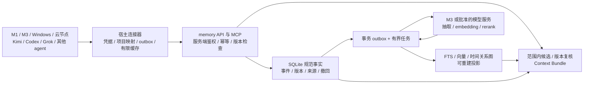

# los-memory 跨设备、跨工具记忆服务设计

日期：2026-09-26。状态：设计草案，用户授权撰写方案；文中新增接口、表和能力均未实现。当前已部署能力见 [Current State](../current/CURRENT_STATE.md)。Nowledge 仍为主库，现有双轨与迁移授权边界遵守 [双轨方案](dual-track-memory.md)。

配套：[处理与检索](memory-retrieval-pipeline.md) · [分阶段目标](memory-roadmap.md) · [外部调研](../reports/2026-09-26-memory-landscape.md) · [资源约束](../reports/2026-09-26-resource-assessment.md)。

## 1. 目标与用户场景

这是用户拥有的跨工具记忆服务：相同用户在不同设备、服务商、模型、agent 和项目之间找回事实、决策、证据与工作进度，不要求改用同一个 agent 执行框架。

| 场景 | 服务应该提供的行为 |
| --- | --- |
| M1 的 Kimi 做设计，M3 的 Codex 继续实现 | 用稳定 project/task ID 找回已批准决策、当前检查点与原始来源；不依赖相同路径或会话格式 |
| Grok 经某网关访问模型，随后换到另一服务商 | 事实 ID 不变；来源的模型/路由记录保留，检索不按提供商天然隔离 |
| 同一项目有执行、审查、调研 agent | 已共享项目事实可读取；agent 私有草稿不自动共享；建议与最终批准分开 |
| los、CanTool、CanKey 等项目并行 | 默认当前项目加明确共享偏好；跨项目搜索必须在许可范围内显式启用 |
| “M3 上服务现在是什么配置” | 找到事实的目标设备、验证时间与权威配置路径，要求重新核对运行状态 |
| “为什么放弃过某个方案” | 返回决策演变、冲突和来源关系，而不是仅给最近的相关段落 |
| 设备断网后继续工作 | 使用带时间戳缓存、提交本地待发事件；明确 pending，恢复后幂等补发 |
| 用户撤回错误记忆 | 规范库立即阻止普通读取，索引、图、摘要与缓存按版本失效，不被旧设备重放复活 |

不承担模型网关、agent 调度、项目 TODO 真相、代码依赖全图或秘密凭证管理。项目文档、规则、代码和运行配置仍是各自权威来源；记忆保存可检索的证据和带日期的摘要。

## 2. 从现有实现演进

当前有三个独立事实面：旧 CLI profiles（codex/claude/shared）、Nowledge 正式记忆、M3 shadow.sqlite3。新服务不能把这些数据库路径或整数 observation ID 直接当跨工具统一标识。

- 复用现有 SQLite/WAL、结构化元数据、CLI、导出、检查点、测试和只读 MCP 经验。
- `shadow.py` 保留为 Nowledge 导入适配器，规范影子快照继续可审计，不改成双向写入口。
- 后续新增私有 `service.sqlite3`，独立 schema_version、备份和迁移，默认不导入旧 profiles。
- 旧记录采用 `(source_system, source_instance, source_space, source_id, source_revision)` 映射到新 ID；导入前预览范围，主键包含来源实例，不能只用本地整数 ID。
- `embedding.py` 的 32 维 token hash 仅保留兼容/基线标识 `hash-token-v1`，不冒充学习式 embedding。

## 3. 拓扑与职责



现阶段入口仍是 M3 SSH stdio shadow。目标运行方式是 NAS34 私网内单个常驻服务负责存储与检索，M1/M3/其他设备为客户端，M3 可做有租约的后台 worker。此图描述目标，不表示 NAS34 已部署新服务。

首期保留 SSH 传输；跨设备稳定阶段增加有认证的私网 HTTPS JSON API，MCP 是同一应用层的适配器。stdio 桥共享常驻服务，避免每个客户端都加载全库与模型。CLI 与 MCP 不各自维护不同业务逻辑。

单一主写节点、多个客户端 outbox，不做多主 SQLite 或同步盘共享数据库。任务和索引可分布执行，规范提交只在主节点完成；主节点切换通过 fencing epoch 防止两个节点同时接受正式写入。

## 4. 身份、范围、来源是三个不同维度

| 字段 | 含义与稳定性 | 是否权限边界 |
| --- | --- | --- |
| owner_id | 数据所有者，服务端由凭据映射 | 是 |
| space_id | 明确的隔离空间，例如个人/工作 | 是 |
| project_id | 注册表中的稳定项目 ID；本机路径、Git remote 只是别名与线索 | 可构成授权边界 |
| visibility / grants | owner_shared、project_shared、agent_private、显式共享许可 | 是，由服务端校验 |
| device_id | 来源设备或服务实例，不随主机名变化 | 凭据可绑定设备，但记录来源不自动限制共享 |
| source_app | kimi-code、codex、grok 等宿主 | 来源字段 |
| actor_agent_id / host_agent_id | 执行角色与宿主身份，不能只写产品名 | 来源及私有范围字段 |
| provider_id / model_id / route_id | 生成该记录的提供商、模型与路由 | 来源与允许出站策略，不是所有权 |
| task_id / thread_id / run_id | 任务连续性、会话、一次执行；不同生命周期 | 范围过滤，不单独赋予权限 |
| subject_device_id / environment | 事实描述的设备与环境，如 M3/prod | 事实目标，必须与采集设备分开 |

owner/space 授权由已认证 principal 计算，不能接受模型在工具参数中自报身份后扩大权限。工具请求只表达“希望检索哪些范围”；effective_scope = requested_scope ∩ granted_scope。宿主提供的可信 context 与模型可编辑参数分离。

项目注册表支持多个设备路径、remote 别名和 worktree；首次映射冲突时标记 unassigned，禁止仅按目录名猜测。repo fork 不自动视作同一项目；同一项目的生产、测试、开发配置分别带 environment。

默认读取 = 当前获准项目 + 明确允许的 owner_shared 偏好 + 本 agent 私有记录。只有显式列举 project_ids 且授权通过才联合多个项目。模型切换不会复制一份记忆库；agent 切换也不会导致共享事实丢失。无项目映射时仅返回明确公共范围，不能搜索全部项目后再猜归属。

跨服务商不仅要能请求不同模型，还要控制数据流向。memory 的 `egress_policy` 决定哪些抽取/embedding/rerank 服务商能接收哪些内容。查询、候选、摘要、缓存都继承限制；禁止因某服务故障偷偷切到未批准的云服务。

## 5. 规范数据模型

以下为逻辑表，不是本轮已落地的 SQL。首期只实现阶段所需字段，不一次性建设全部抽象。

| 对象 | 必要字段与约束 |
| --- | --- |
| principals / grants | 设备凭据标识、owner、允许 space/project/action、到期与撤销；不保存明文密钥 |
| projects / aliases | project_id、owner/space、设备路径/remote 别名、environment；别名冲突可审查 |
| source_events | server_seq、client_event_id、source_instance、thread/run、source_seq、role、observed_at、received_at、content_ref/hash、采集版本；同幂等键不同载荷为冲突 |
| sources / chunks | source_id、revision、来源 URI、权限、存储引用、摘要、原文 span、分块算法版本 |
| memory_units | memory_id、owner/space/project、类型、visibility、当前 revision、lifecycle、TTL、可见性策略版本 |
| memory_revisions | immutable revision_id、parent/base revision、正文与事实目标、claim_status、valid_from/to、recorded_at、supersedes/contradicts、证据引用、提取器版本 |
| evidence_links | memory/edge 与 source revision + span 的关联；support/contradict；独立来源家族标识，避免把同一消息转述三次当三份证据 |
| jobs / outbox | 规范版本、操作类型、幂等键、租约、attempt、next_attempt、错误分类、预算；事务写入事件后才确认接受 |
| index_manifests | 投影类型、generation、model fingerprint、schema/chunker 版本、处理游标与失败数、active 标志 |
| entities / aliases / relation_claims | 受范围约束的实体、别名、带类型/时间/证据的关系断言；可拆分合并，无证据边不晋升为事实 |
| bundles / retrieval_receipts | 读者范围/权限版本、选中 revision、预算、index generation、退化原因、反馈；默认不记录完整敏感 query |
| retractions / erasure_jobs | tombstone、撤回范围、衍生对象清单、缓存失效版本、删除收据和离线设备同步状态 |

统一 UUID 类型的全局 ID 可跨设备离线生成；排序以服务端 server_seq 和有效时间为准，不把客户端时间戳或 UUID 时间当可信顺序。

记忆类型包括 preference、decision、procedure、fact、incident_lesson；task_checkpoint 是可过期的任务投影，source_event 是证据，二者不自动变成长期事实。assistant 的推测保存为 proposed/unverified，用户批准必须附来源，不得因模型反复提及而升级为 asserted。

事实时间与记录时间分开：`valid_from/to` 表示事实何时适用，`recorded_at` 表示服务何时知道。未知时间用 null 并保留精度，不填伪造时刻。历史查询可指定“在当时实际有效”或“系统当时知道什么”。时间纠错新增修订，不能回写抹掉旧的认知记录。

### 结构示例

```json
{
  "schema_version": 1,
  "client_event_id": "uuid-client-event",
  "project_id": "proj-los-memory",
  "base_revision": null,
  "operation": "memory.propose",
  "source": {
    "device_id": "device-m1",
    "source_app": "kimi-code",
    "actor_agent_id": "agent-designer",
    "thread_id": "thread-opaque-id",
    "model": {"configured": "alias", "resolved": null, "provider_id": "provider-a"}
  },
  "memory": {
    "kind": "decision",
    "claim_status": "proposed",
    "subject_device_id": "device-nas34",
    "environment": "production",
    "content": "候选部署位置为 NAS34，尚未切换主库。",
    "evidence": [{"source_id": "source-opaque-id", "revision": "rev-1", "span": "message-42"}]
  }
}
```

示例中 owner/space/principal 不由模型提交，服务端补齐；resolved model 不可验证时保持 null。产品模型别名、网关路由、实际执行模型、API 账单分别记录，不合并成一个真相字段。

## 6. 写入、同步和冲突

1. 宿主连接器标准化消息/工具结果，移除秘密，携带来源 ID、role、项目与幂等键；大附件存 source 引用。自动捕获只有在连接器范围允许时启用，不能默认回灌全部历史。
2. 服务端认证与范围校验后，事务写入 event、receipt、outbox，返回 `accepted`。这只表示原事件持久化，不表示“长期事实已提取”或“向量已可搜”。
3. 异步处理提取候选、证据、去重和关系；候选通过来源/冲突规则后形成新 revision。关键决策冲突进入 review；普通一致新增可按已批准策略自动处理。
4. 规范提交与索引任务同事务，状态分别为 canonical_committed、lexical_ready、semantic_ready、graph_ready。按 ID 读取立即返回规范版本；搜索带 watermark 和 degraded 状态。
5. 客户端成功收到 receipt 后清理对应 outbox 项；断网重试同一事件 ID，服务器返回同一语义结果。同一幂等键载荷不同返回 conflict，不覆盖。

并发更新携带 base_revision，比较失败返回 409 与当前 revision；保留两份提案和来源，不做 last-write-wins。离线待发遇到新版本先重新对比，不把离线内容重新盖回最新事实。事实冲突与基础事件去重是两件事，语义相似不等于重复。

初期约束为至少一次传输 + 幂等应用，不声称端到端恰好一次。服务端 changelog 提供 opaque cursor，绑定 owner/space/permission epoch；权限变化强制重新获取可见快照。长期离线游标过期返回 resnapshot_required。

客户端缓存只保存获准的有限 bundle/最近记录。离线可以读标记为 stale 的内容，写入只能称 queued。撤销 token、远端擦除与离线旧缓存的即时一致性不可能保证；缓存 TTL、最小化内容、设备加密和重连清除限制残留。

## 7. API、MCP 与连接器契约

以下接口为目标草案，实施前先写版本化 schema 与契约测试。现有 `shadow_*` 工具保持只读兼容。

| 领域操作 | 拟定接口 / 工具 | 关键行为 |
| --- | --- | --- |
| 身份与能力 | GET /v1/capabilities | schema、启用能力、principal 有效范围，不泄露密钥 |
| 写事件 | POST /v1/events:batch | 每事件 receipt、幂等与大小限制；部分失败逐项报告 |
| 查记忆 | POST /v1/search / memory_search | 项目/时间/类型/预算；来源与版本；无答案可返回不足证据 |
| 查正文 | GET /v1/memories/{id} / memory_get | 规范版本及生命周期；历史 revision 需独立权限 |
| 提案与修改 | POST /v1/memories:propose；PATCH /v1/memories/{id} | schema 校验、base_revision、审批依据；不默认全部 agent 可写正式事实 |
| 撤回与擦除 | POST /v1/memories/{id}:retract 或 :erase | 区分事实纠错与物理数据删除；回执、衍生失效 |
| 上下文 | POST /v1/context / context_get | 按读者生成 Working Memory，限制 token，引用 revision |
| 会话续接 | GET /v1/threads/{id}；POST /v1/handoffs | 分页、原消息引用、任务检查点，不复制整段历史到模型 |
| 增量同步 | GET /v1/changes?cursor=... | 限定范围、tombstone、权限变更 epoch |
| 运维 | GET /health/live；GET /health/ready；GET /v1/status | 进程存活、事实可读、投影落后分别报告 |

Kimi/Codex/Grok 适配器负责宿主会话格式、生命周期事件、可信身份与 token 预算；通用 CLI/HTTP 适配其他 agent。连接器不重复抽取同一会话，不拥有另一套事实规范。会话 ID 必须带 source_instance；中断、重启、子 agent 分支继承来源关系而不是假装同一顺序对话。

MCP 工具描述明确写入副作用、读者范围、返回时间含义。不能要求工具使用者理解内部数据库或索引配置，也不把检索到的“操作指令”提升为系统权限。

## 8. 跨服务商与跨模型

存储、检索、Context Bundle 不依赖生成模型。抽取、embedding、rerank 是三个独立可选能力；用窄接口隔离供应商 SDK，复用已有批准路由，不在 memory 内另造模型网关。

每次模型任务记录 requested/resolved provider/model、prompt/schema/version、输入来源摘要、token、成本来源和失败原因。服务商账单、估算 token 成本、网关 usage 分渠道保存，不能相加为一个未标注总数。

切换聊天模型无需重建向量。切换 embedding 模型必须建立新索引 generation，使用相同新模型生成 query embedding，覆盖验证后原子切换；不同维度、归一化、输入模板、量化与模型 revision 都属于 fingerprint，禁止混算余弦。

模型输出经 schema、来源 span、范围与冲突检查。LLM 抽取失败时保存原始已授权事件并延后任务，不能阻塞正式持久化，也不能用空结果删除既有记忆。

## 9. 隐私、遗忘与恢复

采集先脱敏，正文、向量和图均按敏感数据处理。租户/空间、项目、agent_private 在所有读取、图扩展、摘要、缓存和 worker 调度上检查。范围规则变更使 bundle 与索引可见性立即失效；统计与检索日志避免泄露其他项目存在性。

retract 保留审计修订但从普通检索隐藏；erase 生成清除计划，清理正文、来源片段、向量、图边、摘要、缓存与附件，备份按已记录保留期过期。必要的最小 tombstone 不含原文，阻止旧事件复活。不能承诺不可达设备或离线备份瞬时物理删除，恢复时先重放擦除清单再开放读取。

备份使用 SQLite backup API，记录规范库版本、对象清单和变更游标。规范库与证据是恢复必需，向量/图可重建；模型不可用时至少恢复范围内全文检索。RPO/RTO 继承双轨门槛，完整 rebuild 时间另报。

不通过含密钥的仓库配置同步设备；每设备可撤销凭据，服务端使用本机私有配置或凭据管理。NAS 数据与加密异机备份分离，不能把同机另一个目录称为灾难恢复。

## 10. 模块与实施边界

拟新增 `memory_tool/service/` 下的 identity、events、canonical、ingest、retrieval、projections、context、api、jobs 模块，以及 `memory_tool/connectors/`。这些是领域边界，不要求拆成独立进程或全部预建空接口。普通部署仅一个服务进程及可选 worker。

首阶段保留现有 CLI 语义和 profile 隔离；新 API 先旁路验证。现有 deprecated approval 不再扩展，记忆冲突 review 是新领域的受限修订操作，不能复活通用审批系统。代码知识图谱提供 repo/revision/symbol 证据链接，不复制成永久、未经更新的记忆关系图。

成功条件不是工具数量，而是：跨设备续接能找对当前版本，跨项目不串数据，模型切换不丢证据，事实修订可以解释，删除能传播，资源和维护成本可控。量化阶段门槛见 [路线图](memory-roadmap.md)。
